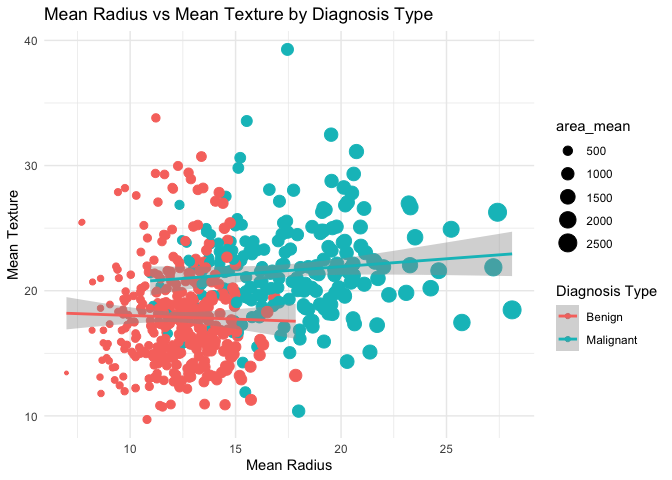

01_random_forest_model
================
2025-10-01

``` r
# Load libraries
library(dplyr)
library(tidyr)
library(here)        # For robust file paths
library(ggplot2)   # For visualization
```

### Load & Prep Data

``` r
#load data
raw_BCWDD <- readr::read_csv(here("_data", "Breast Cancer Wisconsin Data.csv"))
names(raw_BCWDD) <- gsub(names(raw_BCWDD), pattern = " ", replacement = "_")
str(raw_BCWDD)
```

    ## spc_tbl_ [568 × 33] (S3: spec_tbl_df/tbl_df/tbl/data.frame)
    ##  $ id                     : num [1:568] 842302 842517 84300903 84348301 84358402 ...
    ##  $ diagnosis              : chr [1:568] "M" "M" "M" "M" ...
    ##  $ radius_mean            : num [1:568] 18 20.6 19.7 11.4 20.3 ...
    ##  $ texture_mean           : num [1:568] 10.4 17.8 21.2 20.4 14.3 ...
    ##  $ perimeter_mean         : num [1:568] 122.8 132.9 130 77.6 135.1 ...
    ##  $ area_mean              : num [1:568] 1001 1326 1203 386 1297 ...
    ##  $ smoothness_mean        : num [1:568] 0.1184 0.0847 0.1096 0.1425 0.1003 ...
    ##  $ compactness_mean       : num [1:568] 0.2776 0.0786 0.1599 0.2839 0.1328 ...
    ##  $ concavity_mean         : num [1:568] 0.3001 0.0869 0.1974 0.2414 0.198 ...
    ##  $ concave_points_mean    : num [1:568] 0.1471 0.0702 0.1279 0.1052 0.1043 ...
    ##  $ symmetry_mean          : num [1:568] 0.242 0.181 0.207 0.26 0.181 ...
    ##  $ fractal_dimension_mean : num [1:568] 0.0787 0.0567 0.06 0.0974 0.0588 ...
    ##  $ radius_se              : num [1:568] 1.095 0.543 0.746 0.496 0.757 ...
    ##  $ texture_se             : num [1:568] 0.905 0.734 0.787 1.156 0.781 ...
    ##  $ perimeter_se           : num [1:568] 8.59 3.4 4.58 3.44 5.44 ...
    ##  $ area_se                : num [1:568] 153.4 74.1 94 27.2 94.4 ...
    ##  $ smoothness_se          : num [1:568] 0.0064 0.00522 0.00615 0.00911 0.01149 ...
    ##  $ compactness_se         : num [1:568] 0.049 0.0131 0.0401 0.0746 0.0246 ...
    ##  $ concavity_se           : num [1:568] 0.0537 0.0186 0.0383 0.0566 0.0569 ...
    ##  $ concave_points_se      : num [1:568] 0.0159 0.0134 0.0206 0.0187 0.0188 ...
    ##  $ symmetry_se            : num [1:568] 0.03 0.0139 0.0225 0.0596 0.0176 ...
    ##  $ fractal_dimension_se   : num [1:568] 0.00619 0.00353 0.00457 0.00921 0.00511 ...
    ##  $ radius_worst           : num [1:568] 25.4 25 23.6 14.9 22.5 ...
    ##  $ texture_worst          : num [1:568] 17.3 23.4 25.5 26.5 16.7 ...
    ##  $ perimeter_worst        : num [1:568] 184.6 158.8 152.5 98.9 152.2 ...
    ##  $ area_worst             : num [1:568] 2019 1956 1709 568 1575 ...
    ##  $ smoothness_worst       : num [1:568] 0.162 0.124 0.144 0.21 0.137 ...
    ##  $ compactness_worst      : num [1:568] 0.666 0.187 0.424 0.866 0.205 ...
    ##  $ concavity_worst        : num [1:568] 0.712 0.242 0.45 0.687 0.4 ...
    ##  $ concave_points_worst   : num [1:568] 0.265 0.186 0.243 0.258 0.163 ...
    ##  $ symmetry_worst         : num [1:568] 0.46 0.275 0.361 0.664 0.236 ...
    ##  $ fractal_dimension_worst: num [1:568] 0.1189 0.089 0.0876 0.173 0.0768 ...
    ##  $ ...33                  : logi [1:568] NA NA NA NA NA NA ...
    ##  - attr(*, "spec")=
    ##   .. cols(
    ##   ..   id = col_double(),
    ##   ..   diagnosis = col_character(),
    ##   ..   radius_mean = col_double(),
    ##   ..   texture_mean = col_double(),
    ##   ..   perimeter_mean = col_double(),
    ##   ..   area_mean = col_double(),
    ##   ..   smoothness_mean = col_double(),
    ##   ..   compactness_mean = col_double(),
    ##   ..   concavity_mean = col_double(),
    ##   ..   `concave points_mean` = col_double(),
    ##   ..   symmetry_mean = col_double(),
    ##   ..   fractal_dimension_mean = col_double(),
    ##   ..   radius_se = col_double(),
    ##   ..   texture_se = col_double(),
    ##   ..   perimeter_se = col_double(),
    ##   ..   area_se = col_double(),
    ##   ..   smoothness_se = col_double(),
    ##   ..   compactness_se = col_double(),
    ##   ..   concavity_se = col_double(),
    ##   ..   `concave points_se` = col_double(),
    ##   ..   symmetry_se = col_double(),
    ##   ..   fractal_dimension_se = col_double(),
    ##   ..   radius_worst = col_double(),
    ##   ..   texture_worst = col_double(),
    ##   ..   perimeter_worst = col_double(),
    ##   ..   area_worst = col_double(),
    ##   ..   smoothness_worst = col_double(),
    ##   ..   compactness_worst = col_double(),
    ##   ..   concavity_worst = col_double(),
    ##   ..   `concave points_worst` = col_double(),
    ##   ..   symmetry_worst = col_double(),
    ##   ..   fractal_dimension_worst = col_double(),
    ##   ..   ...33 = col_logical()
    ##   .. )
    ##  - attr(*, "problems")=<externalptr>

## Descriptive Summary of Data

``` r
cancer_data <- raw_BCWDD %>% 
  mutate(
    # Convert the diagnosis column to a factor
    # This is ESSENTIAL for classification models in tidymodels
    diagnosis = as.factor(diagnosis)) %>% 
    #diagnosis.fac_lab = factor(diagnosis, levels = c("B", "M"), labels=c("B", "M"))) # 'B' = Benign, 'M' = Malignant
  select(-33) #remove unnamed column if present
```

## Viz

``` r
#regression view of the diagnosis types
cancer_data %>% mutate(diag_text = ifelse(diagnosis == "B", "Benign", "Malignant")) %>%
  ggplot(aes(x=radius_mean, y =  texture_mean, color=diag_text)) +
  geom_point(aes(size=area_mean)) +
  geom_smooth(method="lm")+
  labs(title="Mean Radius vs Mean Texture by Diagnosis Type",
       x="Mean Radius",
       y="Mean Texture",
       color="Diagnosis Type") +
  theme_minimal()
```

<!-- -->

Visualization of three variables; Radius, Texture, Size - and there is
already a reasonable visual separation between Benign and Malignant
diagnosis. However, there is significant cross over in the middle of the
chart. A typical regression model would have difficulty classifying
cases in this area - and similarly a person trying to decide if they
should operate on a potential cancerous growth would be in a coinflip
situation.

This is where machine learning (particularly non-linear methods) that
can incorporate more variables will start to shine in distinguishing the
close match cases. However, visual intuition is often a good marker for
how much we can undertand about how a model will make decisions. (Rule
of 3). If we added in shapes or opacity based on other variables, the
chart would become confusing, even as it might slightly emphasize the
distinctino between Bening and Malignant cases.

``` r
#same chart - RANGE restricted to radius_mean 10:20 and texture_mean 15:30.
cancer_data %>% mutate(diag_text = ifelse(diagnosis == "B", "Benign", "Malignant")) %>%
  dplyr::filter(radius_mean >=10 & radius_mean <=20 & texture_mean >=15 & texture_mean <=30) %>%
  ggplot(aes(x=radius_mean, y =  texture_mean, color=diag_text)) +
  geom_point(aes(size=area_mean, alpha=compactness_mean)) +
  geom_smooth(method="lm")+
  labs(title="Mean Radius vs Mean Texture by Diagnosis Type (Zoomed In)",
       x="Mean Radius",
       y="Mean Texture",
       color="Diagnosis Type") +
  theme_minimal()
```

<!-- --> The updated chart is
focused on the ‘decision boundary’ that will be explored in the ML
models. Only one more variable has been added - compactness - mapped to
opacity. The decision boundary is still quite fuzzy at best!

The Data is will be saved and used in the ML scripts.

### Save Data

``` r
saveRDS(
  cancer_data,
  file = here("_data", "cancer_data_processed.rds")
)
```
