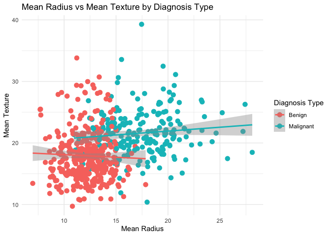
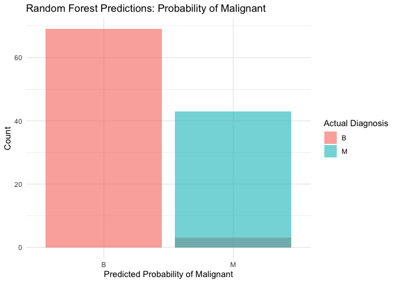

1_data_wrangling
================
…
2025-10-01

# Analysis Scripts

- **Description:**
  - Create two analysis scripts:
    - **Script 1:** Initial descriptions of the breast cancer data set
    - **Script 2:** Implement random forest algorithm using tidy models
      and R
- **Code Organization:**
  - Separate code for each script and analysis

``` r
# Load libraries
library(dplyr)
```

## Load Data

``` r
#load data
raw_dat <- read.csv("../_data/Breast Cancer Wisconsin Data.csv")
str(raw_dat)
```

    ## 'data.frame':    569 obs. of  33 variables:
    ##  $ id                     : int  842302 842517 84300903 84348301 84358402 843786 844359 84458202 844981 84501001 ...
    ##  $ diagnosis              : chr  "M" "M" "M" "M" ...
    ##  $ radius_mean            : num  18 20.6 19.7 11.4 20.3 ...
    ##  $ texture_mean           : num  10.4 17.8 21.2 20.4 14.3 ...
    ##  $ perimeter_mean         : num  122.8 132.9 130 77.6 135.1 ...
    ##  $ area_mean              : num  1001 1326 1203 386 1297 ...
    ##  $ smoothness_mean        : num  0.1184 0.0847 0.1096 0.1425 0.1003 ...
    ##  $ compactness_mean       : num  0.2776 0.0786 0.1599 0.2839 0.1328 ...
    ##  $ concavity_mean         : num  0.3001 0.0869 0.1974 0.2414 0.198 ...
    ##  $ concave.points_mean    : num  0.1471 0.0702 0.1279 0.1052 0.1043 ...
    ##  $ symmetry_mean          : num  0.242 0.181 0.207 0.26 0.181 ...
    ##  $ fractal_dimension_mean : num  0.0787 0.0567 0.06 0.0974 0.0588 ...
    ##  $ radius_se              : num  1.095 0.543 0.746 0.496 0.757 ...
    ##  $ texture_se             : num  0.905 0.734 0.787 1.156 0.781 ...
    ##  $ perimeter_se           : num  8.59 3.4 4.58 3.44 5.44 ...
    ##  $ area_se                : num  153.4 74.1 94 27.2 94.4 ...
    ##  $ smoothness_se          : num  0.0064 0.00522 0.00615 0.00911 0.01149 ...
    ##  $ compactness_se         : num  0.049 0.0131 0.0401 0.0746 0.0246 ...
    ##  $ concavity_se           : num  0.0537 0.0186 0.0383 0.0566 0.0569 ...
    ##  $ concave.points_se      : num  0.0159 0.0134 0.0206 0.0187 0.0188 ...
    ##  $ symmetry_se            : num  0.03 0.0139 0.0225 0.0596 0.0176 ...
    ##  $ fractal_dimension_se   : num  0.00619 0.00353 0.00457 0.00921 0.00511 ...
    ##  $ radius_worst           : num  25.4 25 23.6 14.9 22.5 ...
    ##  $ texture_worst          : num  17.3 23.4 25.5 26.5 16.7 ...
    ##  $ perimeter_worst        : num  184.6 158.8 152.5 98.9 152.2 ...
    ##  $ area_worst             : num  2019 1956 1709 568 1575 ...
    ##  $ smoothness_worst       : num  0.162 0.124 0.144 0.21 0.137 ...
    ##  $ compactness_worst      : num  0.666 0.187 0.424 0.866 0.205 ...
    ##  $ concavity_worst        : num  0.712 0.242 0.45 0.687 0.4 ...
    ##  $ concave.points_worst   : num  0.265 0.186 0.243 0.258 0.163 ...
    ##  $ symmetry_worst         : num  0.46 0.275 0.361 0.664 0.236 ...
    ##  $ fractal_dimension_worst: num  0.1189 0.089 0.0876 0.173 0.0768 ...
    ##  $ X                      : logi  NA NA NA NA NA NA ...

## Descriptive Summary of Data

``` r
mutate_dat <- 
  raw_dat %>% mutate(diag_text = ifelse(diagnosis=="B", "Benign", "Malignant")) %>%  
  group_by(diag_text) %>%
  summarise(
    count = n(),
    mean_radius = mean(radius_mean, na.rm = TRUE),
    mean_texture = mean(texture_mean, na.rm = TRUE)
  )
```

## Viz

``` r
library(ggplot2)
#regression view of the diagnosis types

raw_dat %>% mutate(diag_text = ifelse(diagnosis=="B", "Benign", "Malignant")) %>%  
  ggplot(aes(x=radius_mean, y =  texture_mean, size = area_mean, color=diag_text)) +
  geom_point(size=3) +
  geom_smooth(method="lm")+
  labs(title="Mean Radius vs Mean Texture by Diagnosis Type",
       x="Mean Radius",
       y="Mean Texture",
       color="Diagnosis Type") +
  theme_minimal()
```

<!-- --> \### Comment-CTA:: -
Already we are seeing reasonable separation between the BENING and
MALIGNANT groups based on just a few of these variables… - Dataset
likely would need dimens reduction.

## Minimal Random Forest Implementation

``` r
library(tidymodels)
#install.packages("ranger")
# Set seed for reproducibility
set.seed(123)
```

``` r
# Split the data into training and testing sets
data_split <- initial_split(raw_dat, prop = 0.8, strata = diagnosis)
train_data <- training(data_split)
test_data <- testing(data_split)
```

``` r
# Define the random forest model
rf_model <- rand_forest(mtry = 5, trees = 1000, min_n = 10) %>%
  set_engine("ranger") %>%
  set_mode("classification")
```

``` r
# Create a recipe for preprocessing
rf_recipe <- recipe(diagnosis ~ ., data = train_data) %>%
  step_rm(id) %>%
  step_normalize(all_numeric_predictors())
```

``` r
# Create a workflow
rf_workflow <- workflow() %>%
  add_model(rf_model) %>%
  add_recipe(rf_recipe)
```

``` r
# Train the model
rf_fit <- rf_workflow %>%
  fit(data = train_data)
```

``` r
# Make predictions on the test set
rf_predictions <- rf_fit %>%
  predict(new_data = test_data) %>%
  bind_cols(test_data %>% select(diagnosis))
```

``` r
# Evaluate the model
rf_metrics <- rf_predictions %>% mutate(diagnosis = factor(diagnosis, levels = c("B", "M"))) %>%
  metrics(truth = diagnosis, estimate = .pred_class)

print(rf_metrics)
```

    ## # A tibble: 2 × 3
    ##   .metric  .estimator .estimate
    ##   <chr>    <chr>          <dbl>
    ## 1 accuracy binary         0.974
    ## 2 kap      binary         0.945

## Plot to show Prediction differential

``` r
rf_predictions %>%
  ggplot(aes(x = .pred_class, fill = diagnosis)) +
  geom_histogram(stat = "count", position = "identity", alpha = 0.6, bins = 30) +
  labs(title = "Random Forest Predictions: Probability of Malignant",
       x = "Predicted Probability of Malignant",
       y = "Count",
       fill = "Actual Diagnosis") +
  theme_minimal()
```

<!-- -->
