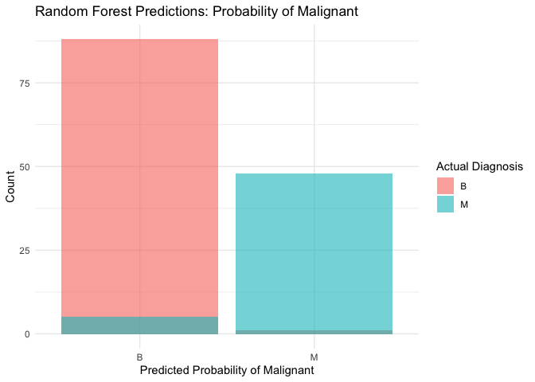
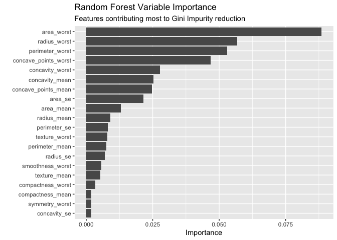

01_random_forest_model
================
2025-10-01

## Random Forest Implementation

### Methodological Note:

The Random Forest (RF) algorithm functions as an ensemble of decision
trees. Mathematically, given a dataset
$D = \{(x_1, y_1), \dots, (x_N, y_N)\}$, the RF predictor $\hat{f}_{rf}$
aggregates the votes of $B$
trees:$$ \hat{f}_{rf}^{B}(x) = \text{majority vote} { \hat{C}b(x) }{1}^{B} $$where
$\hat{C}_b(x)$ is the class prediction of the $b$-th tree. - This method
is particularly suited for the Breast Cancer Wisconsin dataset because
it handles the high multicollinearity between features (e.g.,
radius_mean vs. area_mean) by randomly selecting subsets of features at
each split, allowing correlated variables to contribute independently to
the model logic.

``` r
# Load libraries
library(dplyr)
library(tidymodels)  # For the core modeling workflow
library(tidyverse)   # For general data manipulation and loading
library(here)        # For robust file paths
library(ggplot2)     # For visualization
library(vip)         #variables of importance
set.seed(8888) 
```

### Load & Prep Data

``` r
#load data
cancer_data <- readRDS(here("_data", "cancer_data_processed.rds")) #processed in00 data_wrangling script.
str(cancer_data)
```

    ## tibble [568 × 32] (S3: tbl_df/tbl/data.frame)
    ##  $ id                     : num [1:568] 842302 842517 84300903 84348301 84358402 ...
    ##  $ diagnosis              : Factor w/ 2 levels "B","M": 2 2 2 2 2 2 2 2 2 2 ...
    ##  $ radius_mean            : num [1:568] 18 20.6 19.7 11.4 20.3 ...
    ##  $ texture_mean           : num [1:568] 10.4 17.8 21.2 20.4 14.3 ...
    ##  $ perimeter_mean         : num [1:568] 122.8 132.9 130 77.6 135.1 ...
    ##  $ area_mean              : num [1:568] 1001 1326 1203 386 1297 ...
    ##  $ smoothness_mean        : num [1:568] 0.1184 0.0847 0.1096 0.1425 0.1003 ...
    ##  $ compactness_mean       : num [1:568] 0.2776 0.0786 0.1599 0.2839 0.1328 ...
    ##  $ concavity_mean         : num [1:568] 0.3001 0.0869 0.1974 0.2414 0.198 ...
    ##  $ concave_points_mean    : num [1:568] 0.1471 0.0702 0.1279 0.1052 0.1043 ...
    ##  $ symmetry_mean          : num [1:568] 0.242 0.181 0.207 0.26 0.181 ...
    ##  $ fractal_dimension_mean : num [1:568] 0.0787 0.0567 0.06 0.0974 0.0588 ...
    ##  $ radius_se              : num [1:568] 1.095 0.543 0.746 0.496 0.757 ...
    ##  $ texture_se             : num [1:568] 0.905 0.734 0.787 1.156 0.781 ...
    ##  $ perimeter_se           : num [1:568] 8.59 3.4 4.58 3.44 5.44 ...
    ##  $ area_se                : num [1:568] 153.4 74.1 94 27.2 94.4 ...
    ##  $ smoothness_se          : num [1:568] 0.0064 0.00522 0.00615 0.00911 0.01149 ...
    ##  $ compactness_se         : num [1:568] 0.049 0.0131 0.0401 0.0746 0.0246 ...
    ##  $ concavity_se           : num [1:568] 0.0537 0.0186 0.0383 0.0566 0.0569 ...
    ##  $ concave_points_se      : num [1:568] 0.0159 0.0134 0.0206 0.0187 0.0188 ...
    ##  $ symmetry_se            : num [1:568] 0.03 0.0139 0.0225 0.0596 0.0176 ...
    ##  $ fractal_dimension_se   : num [1:568] 0.00619 0.00353 0.00457 0.00921 0.00511 ...
    ##  $ radius_worst           : num [1:568] 25.4 25 23.6 14.9 22.5 ...
    ##  $ texture_worst          : num [1:568] 17.3 23.4 25.5 26.5 16.7 ...
    ##  $ perimeter_worst        : num [1:568] 184.6 158.8 152.5 98.9 152.2 ...
    ##  $ area_worst             : num [1:568] 2019 1956 1709 568 1575 ...
    ##  $ smoothness_worst       : num [1:568] 0.162 0.124 0.144 0.21 0.137 ...
    ##  $ compactness_worst      : num [1:568] 0.666 0.187 0.424 0.866 0.205 ...
    ##  $ concavity_worst        : num [1:568] 0.712 0.242 0.45 0.687 0.4 ...
    ##  $ concave_points_worst   : num [1:568] 0.265 0.186 0.243 0.258 0.163 ...
    ##  $ symmetry_worst         : num [1:568] 0.46 0.275 0.361 0.664 0.236 ...
    ##  $ fractal_dimension_worst: num [1:568] 0.1189 0.089 0.0876 0.173 0.0768 ...

### 2. Data Splitting

``` r
# 3. DATA SPLITTING
# Create the stratified data split (75% training, 25% testing)
data_split <- initial_split(cancer_data, prop = 0.75, strata = diagnosis)

# Create the training and testing data frames
train_data <- training(data_split)
test_data  <- testing(data_split)

# Check the proportions in each set
train_data %>% count(diagnosis) %>% mutate(prop = n/sum(n))
```

    ## # A tibble: 2 × 3
    ##   diagnosis     n  prop
    ##   <fct>     <int> <dbl>
    ## 1 B           267 0.627
    ## 2 M           159 0.373

``` r
test_data %>% count(diagnosis) %>% mutate(prop = n/sum(n))
```

    ## # A tibble: 2 × 3
    ##   diagnosis     n  prop
    ##   <fct>     <int> <dbl>
    ## 1 B            89 0.627
    ## 2 M            53 0.373

## fit a single model

``` r
# Define the random forest model
rf_model <- rand_forest(mtry = 5, trees = 1000, min_n = 10) %>%
  set_engine("ranger") %>%
  set_mode("classification")

#{r recipe-preprocess}
# Create a recipe for preprocessing
rf_recipe <- recipe(diagnosis ~ ., data = train_data) %>%
  step_rm(id) %>%
  step_normalize(all_numeric_predictors())

#
# Create a workflow
rf_workflow <- workflow() %>%
  add_model(rf_model) %>%
  add_recipe(rf_recipe)

#{r training-fitting}
# Train the model
rf_fit <- rf_workflow %>%
  fit(data = train_data)

#{r model-predictions}
# Make predictions on the test set
rf_predictions <- rf_fit %>%
  predict(new_data = test_data) %>%
  bind_cols(test_data %>% select(diagnosis))

rf_predictions
```

    ## # A tibble: 142 × 2
    ##    .pred_class diagnosis
    ##    <fct>       <fct>    
    ##  1 M           M        
    ##  2 M           M        
    ##  3 M           M        
    ##  4 M           M        
    ##  5 M           M        
    ##  6 M           M        
    ##  7 M           M        
    ##  8 B           B        
    ##  9 M           M        
    ## 10 B           B        
    ## # ℹ 132 more rows

``` r
# Evaluate the model
rf_metrics <- rf_predictions %>% mutate(diagnosis = factor(diagnosis, levels = c("B", "M"))) %>%
  metrics(truth = diagnosis, estimate = .pred_class)

print(rf_metrics)
```

    ## # A tibble: 2 × 3
    ##   .metric  .estimator .estimate
    ##   <chr>    <chr>          <dbl>
    ## 1 accuracy binary         0.958
    ## 2 kap      binary         0.908

## Plot to show Prediction differential

``` r
rf_predictions %>%
  ggplot(aes(x = .pred_class, fill = diagnosis)) +
  geom_histogram(stat = "count", position = "identity", alpha = 0.6, bins = 30) +
  labs(title = "Random Forest Predictions: Probability of Malignant",
       x = "Predicted Probability of Malignant",
       y = "Count",
       fill = "Actual Diagnosis") +
  theme_minimal()
```

<!-- -->

**Comments** - This bar plot is showing the model predictions vs
accuracy. Essentially, the SMALL OVERLAP in the light Blue (M) for
malignant is showing where the model classified a BENIGN tumor as
Malignant.

## Machine Learning Routine

- This is the same as above, but a **workflow** is put into place to
  evaluate the (already quite good) random forest algorithm across
  multiple parameters. This is the best practice for improving accuracy.

``` r
#set.seed(8888)
# Create 10-fold cross-validation folds from the training data
cv_folds <- vfold_cv(train_data, v = 10, strata = diagnosis)
```

### Model Specification for Tuning

We will tune `mtry` (number of predictors per split) and `min_n`
(minimum node size). Engine to `ranger` for speed and to enable variable
importance. Note, ranger uses GINI coefficient to optimise.

We tune two key hyperparameters to control overfitting and model
complexity:

mtry: The number of variables randomly sampled as candidates at each
split. Tuning this helps decorrelate the trees.

min_n: The minimum number of data points required in a node to split
further. Larger values prevent the trees from learning noise
(overfitting).

``` r
# Define the random forest model, but with tunable parameters
rf_spec_tune <- rand_forest(
  mtry = tune(),
  trees = 1000, # 1000 trees is usually enough, no need to tune
  min_n = tune()
) %>%
  set_engine("ranger", importance = "permutation") %>% # Set importance for vip
  set_mode("classification")
```

### Recipe and Workflow

Update the recipe with the tuning step, and tunable model (ranger model)

``` r
rf_recipe <- recipe(diagnosis ~ ., data = train_data) %>%
  update_role(id, new_role = "ID") %>% # Keep ID but don't use it
  step_normalize(all_numeric_predictors())

# Create a new workflow for *tuning*
rf_workflow_tune <- workflow() %>%
  add_model(rf_spec_tune) %>%
  add_recipe(rf_recipe)
```

### Hyperparameter Tuning

Now we run the tuning process across our 10 CV folds.

``` r
# Create a grid of hyperparameters to try
rf_grid <- grid_latin_hypercube(
  mtry(range = c(1, 30)), # Try values for mtry from 1 to 30
  min_n(range = c(2, 20)), # Try values for min_n from 2 to 20
  #trees(range = c(200,2000)), # Try values for trees from 200 to 2000
  size = 20
)

# Run the tuning
rf_tune_results <- tune_grid(
  rf_workflow_tune,
  resamples = cv_folds,
  grid = rf_grid,
  #metrics = metric_set(accuracy, precision, recall),
  control = control_grid(save_workflow=TRUE)
)

# Show the top 5 best-performing hyperparameter sets
show_best(rf_tune_results, metric = "accuracy")
```

    ## # A tibble: 5 × 8
    ##    mtry min_n .metric  .estimator  mean     n std_err .config         
    ##   <int> <int> <chr>    <chr>      <dbl> <int>   <dbl> <chr>           
    ## 1     8     6 accuracy binary     0.965    10 0.00624 pre0_mod05_post0
    ## 2     8    20 accuracy binary     0.965    10 0.00624 pre0_mod06_post0
    ## 3    11     2 accuracy binary     0.965    10 0.00528 pre0_mod07_post0
    ## 4    16     5 accuracy binary     0.965    10 0.00528 pre0_mod11_post0
    ## 5    27     3 accuracy binary     0.965    10 0.00398 pre0_mod18_post0

``` r
# Select the single best set of parameters
best_rf_params <- select_best(rf_tune_results, metric = "accuracy")

# Print the best parameters
print(best_rf_params)
```

    ## # A tibble: 1 × 3
    ##    mtry min_n .config         
    ##   <int> <int> <chr>           
    ## 1     8     6 pre0_mod05_post0

### Finalize and Evaluate Model

With our best parameters, we do a `last_fit()` to get our final,
unbiased test metrics.

``` r
# Finalize the workflow with the best parameters
final_rf_workflow <- finalize_workflow(
  rf_workflow_tune,
  best_rf_params
)

# Use 'last_fit' to fit on the full training set and evaluate on the test set
final_rf_fit <- last_fit(
  final_rf_workflow,
  data_split
)
```

### Review Performance Metrics

Let’s see how our *tuned* model performed on the test data.

### NOTES:

- Standard accuracy can be misleading in medical diagnosis if classes
  are imbalanced. We analyze Precision (Positive Predictive Value) and
  Recall (Sensitivity).

``` r
# Get the metrics from our test-set evaluation
rf_test_metrics <- collect_metrics(final_rf_fit)

# Get the predictions to build a confusion matrix
rf_test_predictions <- collect_predictions(final_rf_fit)
```

``` r
rf_predictions <- collect_predictions(final_rf_fit)
ml_mets <- metric_set(accuracy, precision, recall, f_meas)
ml_mets(rf_test_predictions, truth = diagnosis, estimate = .pred_class)
```

    ## # A tibble: 4 × 3
    ##   .metric   .estimator .estimate
    ##   <chr>     <chr>          <dbl>
    ## 1 accuracy  binary         0.951
    ## 2 precision binary         0.936
    ## 3 recall    binary         0.989
    ## 4 f_meas    binary         0.962

``` r
# Generate and print the confusion matrix
conf_matrix <- conf_mat(
  rf_predictions,
  truth = diagnosis,
  estimate = .pred_class,
  options = list(positive = "M")
)

print(conf_matrix)
```

    ##           Truth
    ## Prediction  B  M
    ##          B 88  6
    ##          M  1 47

``` r
autoplot(conf_matrix, type = "heatmap")
```

<!-- -->

``` r
# Precision-Recall Curve
# Visualizes the trade-off between capturing all cancers (Recall) 
# and ensuring positive predictions are actually cancer (Precision).

## ROC -AUC
rf_test_predictions %>%
  roc_curve(diagnosis, .pred_B) %>%
  autoplot() +
  labs(
    title = "ROC Curve: Random Forest",
    subtitle = "Performance of the Best Fit Params against Test Data"
  )
```

<!-- -->

``` r
###---

rf_predictions %>%
  pr_curve(diagnosis, .pred_M) %>%
  autoplot() +
  labs(
    title = "Precision-Recall Curve: Random Forest",
    subtitle = "Area under the curve indicates model robustness for the 'Malignant' class"
  )
```

<!-- -->

### Feature Importance

This is a key benefit of Random Forest. We can see which variables the
model used most to make its decisions.

``` r
#library(vip)
# Extract the fitted model object
fitted_rf_model <- extract_workflow(final_rf_fit)
best_rf_fit <- fit_best(rf_tune_results)

# Use the 'vip' package to create a variable importance plot
print("Plotting Variable Importance...")
```

    ## [1] "Plotting Variable Importance..."

``` r
vip(fitted_rf_model, num_features = 20) +
  labs(title = "Random Forest Variable Importance",
       subtitle = "Features contributing most to Gini Impurity reduction")
```

<!-- -->

### Save Model Artifacts

``` r
# Save the final, fitted workflow
saveRDS(
  list("model" = final_rf_fit, "metrics" = rf_test_metrics, "preds" = rf_test_predictions),
  file = here("_models", "final_rf_output.rds")
)

## Save the test metrics
#saveRDS(
#  test_metrics,
#  file = here("_models", "rf_test_metrics.rds")
#)
```
