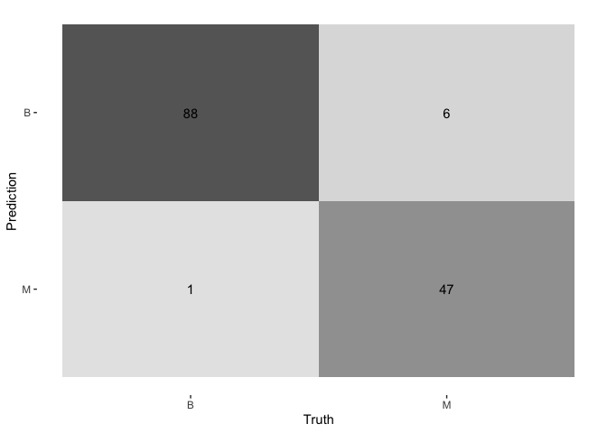

02_lasso_regression.md
================
2025-10-31

This script implements Step 4 of the project proposal: fitting and
tuning a non-linear Support Vector Machine (SVM) model with a Radial
Basis Function (RBF) kernel.

``` r
library(tidymodels)  # For the core modeling workflow
library(tidyverse)   # For general data manipulation and loading
library(here)        # For robust file paths
library(kernlab)     # The 'engine' for SVM calculations
library(conflicted)  # To manage function name conflicts
library(vip)         #variables of importance

# Set a seed for reproducibility
set.seed(8888) 
```

## OUTLINE OF ANALYSIS

Model 3 (SVM): Implement Support Vector Machines - Use k-fold
cross-validation. - Evaluate using metrics/comparisons for SVM
performance on BCWDD (Breast Cancer Diagnosis Dataset). - Evaluate Model
Output, consideration. Indications of critical variables etc…

### 1. Load Data

``` r
#load data
cancer_data <- readRDS(here("_data", "cancer_data_processed.rds")) #processed in00 data_wrangling script.
str(cancer_data)
```

    ## tibble [568 × 32] (S3: tbl_df/tbl/data.frame)
    ##  $ id                     : num [1:568] 842302 842517 84300903 84348301 84358402 ...
    ##  $ diagnosis              : Factor w/ 2 levels "B","M": 2 2 2 2 2 2 2 2 2 2 ...
    ##  $ radius_mean            : num [1:568] 18 20.6 19.7 11.4 20.3 ...
    ##  $ texture_mean           : num [1:568] 10.4 17.8 21.2 20.4 14.3 ...
    ##  $ perimeter_mean         : num [1:568] 122.8 132.9 130 77.6 135.1 ...
    ##  $ area_mean              : num [1:568] 1001 1326 1203 386 1297 ...
    ##  $ smoothness_mean        : num [1:568] 0.1184 0.0847 0.1096 0.1425 0.1003 ...
    ##  $ compactness_mean       : num [1:568] 0.2776 0.0786 0.1599 0.2839 0.1328 ...
    ##  $ concavity_mean         : num [1:568] 0.3001 0.0869 0.1974 0.2414 0.198 ...
    ##  $ concave_points_mean    : num [1:568] 0.1471 0.0702 0.1279 0.1052 0.1043 ...
    ##  $ symmetry_mean          : num [1:568] 0.242 0.181 0.207 0.26 0.181 ...
    ##  $ fractal_dimension_mean : num [1:568] 0.0787 0.0567 0.06 0.0974 0.0588 ...
    ##  $ radius_se              : num [1:568] 1.095 0.543 0.746 0.496 0.757 ...
    ##  $ texture_se             : num [1:568] 0.905 0.734 0.787 1.156 0.781 ...
    ##  $ perimeter_se           : num [1:568] 8.59 3.4 4.58 3.44 5.44 ...
    ##  $ area_se                : num [1:568] 153.4 74.1 94 27.2 94.4 ...
    ##  $ smoothness_se          : num [1:568] 0.0064 0.00522 0.00615 0.00911 0.01149 ...
    ##  $ compactness_se         : num [1:568] 0.049 0.0131 0.0401 0.0746 0.0246 ...
    ##  $ concavity_se           : num [1:568] 0.0537 0.0186 0.0383 0.0566 0.0569 ...
    ##  $ concave_points_se      : num [1:568] 0.0159 0.0134 0.0206 0.0187 0.0188 ...
    ##  $ symmetry_se            : num [1:568] 0.03 0.0139 0.0225 0.0596 0.0176 ...
    ##  $ fractal_dimension_se   : num [1:568] 0.00619 0.00353 0.00457 0.00921 0.00511 ...
    ##  $ radius_worst           : num [1:568] 25.4 25 23.6 14.9 22.5 ...
    ##  $ texture_worst          : num [1:568] 17.3 23.4 25.5 26.5 16.7 ...
    ##  $ perimeter_worst        : num [1:568] 184.6 158.8 152.5 98.9 152.2 ...
    ##  $ area_worst             : num [1:568] 2019 1956 1709 568 1575 ...
    ##  $ smoothness_worst       : num [1:568] 0.162 0.124 0.144 0.21 0.137 ...
    ##  $ compactness_worst      : num [1:568] 0.666 0.187 0.424 0.866 0.205 ...
    ##  $ concavity_worst        : num [1:568] 0.712 0.242 0.45 0.687 0.4 ...
    ##  $ concave_points_worst   : num [1:568] 0.265 0.186 0.243 0.258 0.163 ...
    ##  $ symmetry_worst         : num [1:568] 0.46 0.275 0.361 0.664 0.236 ...
    ##  $ fractal_dimension_worst: num [1:568] 0.1189 0.089 0.0876 0.173 0.0768 ...

### 2. Data Splitting

We use the same stratified split parameters and seed as the SVM script
to ensure the train/test sets are identical.

``` r
# 3. DATA SPLITTING
# Create the stratified data split (75% training, 25% testing)
data_split <- initial_split(cancer_data, prop = 0.75, strata = diagnosis)

# Create the training and testing data frames
train_data <- training(data_split)
test_data  <- testing(data_split)

# Check the proportions in each set
train_data %>% count(diagnosis) %>% mutate(prop = n/sum(n))
```

    ## # A tibble: 2 × 3
    ##   diagnosis     n  prop
    ##   <fct>     <int> <dbl>
    ## 1 B           267 0.627
    ## 2 M           159 0.373

``` r
test_data %>% count(diagnosis) %>% mutate(prop = n/sum(n))
```

    ## # A tibble: 2 × 3
    ##   diagnosis     n  prop
    ##   <fct>     <int> <dbl>
    ## 1 B            89 0.627
    ## 2 M            53 0.373

### 3. Preprocessing Recipe

We define our preprocessing steps. For an SVM, it is **critical** that
we `step_scale()` and `step_center()` all numeric predictors. The recipe
will be *trained* on the training data and *applied* to both train and
test sets.

``` r
# 4. PREPROCESSING RECIPE
# We are predicting 'diagnosis' using all other variables (.).
# The only predictor we *don't* want is 'id', so we remove it.
# We then center and scale ALL numeric predictors.
svm_recipe <- recipe(diagnosis ~ ., data = train_data) %>%
  update_role(id, new_role = "ID") %>% # Keep ID but don't use it as a predictor
  step_normalize(all_numeric_predictors()) # Centers and scales

# You can check the recipe
# summary(svm_recipe)
```

### 4. Cross-Validation Folds

We create 10-fold cross-validation folds from our *training data*. This
will be used to tune the model’s hyperparameters.

``` r
# 5. CROSS-VALIDATION FOLDS
# Create 10-fold cross-validation folds from the training data
cv_folds <- vfold_cv(train_data, v = 10, strata = diagnosis)
```

### Working out the Model fit code

``` r
#run a single SVM fit
svm_fit <- svm_rbf(cost = 1, rbf_sigma = 0.1) %>%
  set_mode("classification") %>%
  set_engine("kernlab") %>%
  #fit(diagnosisdata = train_data)
  fit(diagnosis ~ ., data = train_data %>% select(-id))

summary(svm_fit)
```

    ##              Length Class   Mode     
    ## lvl          2      -none-  character
    ## spec         8      svm_rbf list     
    ## fit          1      ksvm    S4       
    ## preproc      1      -none-  list     
    ## elapsed      1      -none-  list     
    ## censor_probs 0      -none-  list

``` r
preds <- predict(object = svm_fit, train_data)
compare <- data.frame(truth = train_data$diagnosis, estimate = preds$.pred_class)
yardstick::accuracy(data = compare, truth = truth, estimate = estimate)
```

    ## # A tibble: 1 × 3
    ##   .metric  .estimator .estimate
    ##   <chr>    <chr>          <dbl>
    ## 1 accuracy binary         0.991

### 5. Model Specification & Tuning

Here we define the SVM model, specify which hyperparameters we want to
tune (`cost` and `rbf_sigma`), and create a tuning grid.

``` r
# 6. MODEL SPECIFICATION
# We specify a radial basis function (RBF) kernel SVM
# We set the 'engine' to 'kernlab'
# We will tune 'cost' (the C parameter) and 'rbf_sigma' (gamma)
svm_spec <- svm_rbf(cost = tune(), rbf_sigma = tune()) %>%
  set_engine("kernlab") %>%
  set_mode("classification")

# 7. CREATE WORKFLOW
# Combine the recipe and model spec into a single workflow object
svm_workflow <- workflow() %>%
  add_recipe(svm_recipe) %>%
  add_model(svm_spec)

# 8. HYPERPARAMETER TUNING
# Create a grid of hyperparameters to try
# We will use a space-filling design to get 25 combinations
svm_grid <- grid_latin_hypercube(
  cost(),
  rbf_sigma(),
  size = 25
)

ctrl <- control_grid(save_workflow = TRUE)

# Run the tuning process across all CV folds
# This will try all 25 hyperparameter combinations on our 10 folds
svm_tune_results <- tune_grid(
  svm_workflow,
  resamples = cv_folds,
  grid = svm_grid,
  control=ctrl)

# Show the top 5 best-performing hyperparameter sets
show_best(svm_tune_results, metric = "accuracy")
```

    ## # A tibble: 5 × 8
    ##       cost    rbf_sigma .metric  .estimator  mean     n std_err .config         
    ##      <dbl>        <dbl> <chr>    <chr>      <dbl> <int>   <dbl> <chr>           
    ## 1 21.5     0.000318     accuracy binary     0.976    10 0.00787 Preprocessor1_M…
    ## 2 19.7     0.00104      accuracy binary     0.974    10 0.00900 Preprocessor1_M…
    ## 3  0.605   0.00550      accuracy binary     0.960    10 0.0107  Preprocessor1_M…
    ## 4  0.496   0.0000000102 accuracy binary     0.627    10 0.00142 Preprocessor1_M…
    ## 5  0.00715 0.000239     accuracy binary     0.627    10 0.00142 Preprocessor1_M…

``` r
# Select the single best set of parameters based on accuracy
best_svm_params <- select_best(svm_tune_results, metric = "accuracy")
```

### 6. Finalize and Evaluate Model

Now we update our workflow with the *best* parameters and fit it one
last time to the *full training set*. Then, we evaluate its performance
on the *held-out test set*.

``` r
# 9. FINALIZE WORKFLOW
# Update the workflow with the best parameters we just found
final_svm_workflow <- finalize_workflow(
  svm_workflow,
  best_svm_params
)

# 10. FIT ON TRAIN, EVALUATE ON TEST
# Use the 'last_fit' function to:
# 1. Fit the final workflow on the *entire training set*
# 2. Evaluate that fitted model on the *testing set*
final_svm_fit <- last_fit(
  final_svm_workflow,
  data_split
)
```

### 7. Review Performance Metrics

Compare *tuned* model to test data

``` r
# Get the MODEL METRICS metrics from our test-set evaluation
test_metrics <- collect_metrics(final_svm_fit)
print(test_metrics)
```

    ## # A tibble: 3 × 4
    ##   .metric     .estimator .estimate .config             
    ##   <chr>       <chr>          <dbl> <chr>               
    ## 1 accuracy    binary        0.958  Preprocessor1_Model1
    ## 2 roc_auc     binary        0.989  Preprocessor1_Model1
    ## 3 brier_class binary        0.0306 Preprocessor1_Model1

## Accuracy, Sensitivity, Recall Metrics

``` r
# Get the PERFORMANCE metrics predictions to build a confusion matrix
test_predictions <- collect_predictions(final_svm_fit)
# Metrics from ML Course
ml_mets <- metric_set(accuracy, precision, recall)
ml_mets(test_predictions, truth = diagnosis, estimate = .pred_class)
```

    ## # A tibble: 3 × 3
    ##   .metric   .estimator .estimate
    ##   <chr>     <chr>          <dbl>
    ## 1 accuracy  binary         0.958
    ## 2 precision binary         0.946
    ## 3 recall    binary         0.989

## Generate and print the confusion matrix

``` r
# Note: In a confusion matrix, 'M' (Malignant) is our "positive" class.
# We set 'M' to be the first level to ensure this.
conf_matrix <- conf_mat(
  test_predictions,
  truth = diagnosis,
  estimate = .pred_class,
  options = list(positive = "M") # Explicitly set positive class
)

print(conf_matrix)
```

    ##           Truth
    ## Prediction  B  M
    ##          B 88  5
    ##          M  1 48

``` r
#Heatmap
autoplot(conf_matrix, type = "heatmap")
```

<!-- -->

### 8. Save Model Artifacts

``` r
# 12. SAVE ARTIFACTS
# Save the final, fitted workflow
saveRDS(
  list("model" = final_svm_fit, "metrics" = test_metrics, "preds" = test_predictions),
  file = here("_models", "final_svm_output.rds")
)
```
