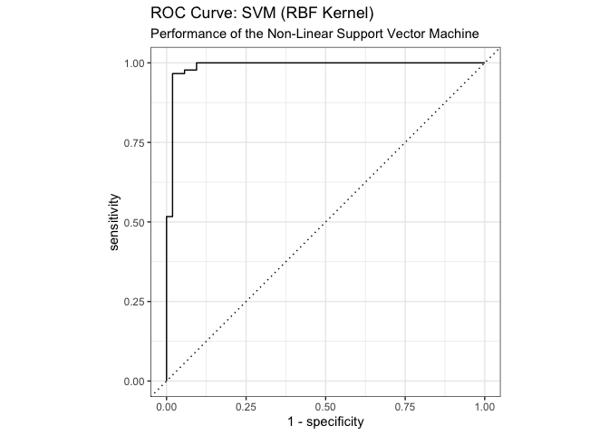

02_lasso_regression.md
================
2025-10-31

This script implements Step 4 of the project proposal: fitting and
tuning a non-linear Support Vector Machine (SVM) model with a Radial
Basis Function (RBF) kernel.

``` r
library(dplyr)
library(tidymodels)  # For the core modeling workflow
library(tidyverse)   # For general data manipulation and loading
library(here)        # For robust file paths
library(kernlab)     # The 'engine' for SVM calculations
library(conflicted)  # To manage function name conflicts
library(vip)         #variables of importance

# Set a seed for reproducibility
set.seed(8888) 
```

**OUTLINE OF ANALYSIS **

Model 3 (SVM): Implement Support Vector Machines - Use k-fold
cross-validation. - Evaluate using metrics/comparisons for SVM
performance on BCWDD (Breast Cancer Diagnosis Dataset). - Evaluate Model
Output, consideration. Indications of critical variables etc…

## Support Vector Machine (SVM) Implementation

### Methodological Note:

SVM searches for an optimal hyperplane that separates the two classes
(Benign vs. Malignant) with the maximum margin. Since the tumor data is
not linearly separable (complex overlaps between classes), we use the
Kernel Trick. Optimization Problem: We minimize the following cost
function:
$$ \min_{w, b, \xi} \left( \frac{1}{2} ||w||^2 + C \sum_{i=1}^{N} \xi_i \right) $$
Subject to:$$ y_i (w \cdot \phi(x_i) + b) \geq 1 - \xi_i $$
Where:$\phi(x_i)$ maps the input vectors into a higher-dimensional
space.$\xi_i$ are slack variables allowing for some misclassification
(controlled by $C$). The RBF Kernel handles the mapping implicitly:
$K(x_i, x_j) = \exp(-\gamma ||x_i - x_j||^2)$.

### 1. Load Data

``` r
#load data
cancer_data <- readRDS(here("_data", "cancer_data_processed.rds")) #processed in00 data_wrangling script.
str(cancer_data)
```

    ## tibble [568 × 32] (S3: tbl_df/tbl/data.frame)
    ##  $ id                     : num [1:568] 842302 842517 84300903 84348301 84358402 ...
    ##  $ diagnosis              : Factor w/ 2 levels "B","M": 2 2 2 2 2 2 2 2 2 2 ...
    ##  $ radius_mean            : num [1:568] 18 20.6 19.7 11.4 20.3 ...
    ##  $ texture_mean           : num [1:568] 10.4 17.8 21.2 20.4 14.3 ...
    ##  $ perimeter_mean         : num [1:568] 122.8 132.9 130 77.6 135.1 ...
    ##  $ area_mean              : num [1:568] 1001 1326 1203 386 1297 ...
    ##  $ smoothness_mean        : num [1:568] 0.1184 0.0847 0.1096 0.1425 0.1003 ...
    ##  $ compactness_mean       : num [1:568] 0.2776 0.0786 0.1599 0.2839 0.1328 ...
    ##  $ concavity_mean         : num [1:568] 0.3001 0.0869 0.1974 0.2414 0.198 ...
    ##  $ concave_points_mean    : num [1:568] 0.1471 0.0702 0.1279 0.1052 0.1043 ...
    ##  $ symmetry_mean          : num [1:568] 0.242 0.181 0.207 0.26 0.181 ...
    ##  $ fractal_dimension_mean : num [1:568] 0.0787 0.0567 0.06 0.0974 0.0588 ...
    ##  $ radius_se              : num [1:568] 1.095 0.543 0.746 0.496 0.757 ...
    ##  $ texture_se             : num [1:568] 0.905 0.734 0.787 1.156 0.781 ...
    ##  $ perimeter_se           : num [1:568] 8.59 3.4 4.58 3.44 5.44 ...
    ##  $ area_se                : num [1:568] 153.4 74.1 94 27.2 94.4 ...
    ##  $ smoothness_se          : num [1:568] 0.0064 0.00522 0.00615 0.00911 0.01149 ...
    ##  $ compactness_se         : num [1:568] 0.049 0.0131 0.0401 0.0746 0.0246 ...
    ##  $ concavity_se           : num [1:568] 0.0537 0.0186 0.0383 0.0566 0.0569 ...
    ##  $ concave_points_se      : num [1:568] 0.0159 0.0134 0.0206 0.0187 0.0188 ...
    ##  $ symmetry_se            : num [1:568] 0.03 0.0139 0.0225 0.0596 0.0176 ...
    ##  $ fractal_dimension_se   : num [1:568] 0.00619 0.00353 0.00457 0.00921 0.00511 ...
    ##  $ radius_worst           : num [1:568] 25.4 25 23.6 14.9 22.5 ...
    ##  $ texture_worst          : num [1:568] 17.3 23.4 25.5 26.5 16.7 ...
    ##  $ perimeter_worst        : num [1:568] 184.6 158.8 152.5 98.9 152.2 ...
    ##  $ area_worst             : num [1:568] 2019 1956 1709 568 1575 ...
    ##  $ smoothness_worst       : num [1:568] 0.162 0.124 0.144 0.21 0.137 ...
    ##  $ compactness_worst      : num [1:568] 0.666 0.187 0.424 0.866 0.205 ...
    ##  $ concavity_worst        : num [1:568] 0.712 0.242 0.45 0.687 0.4 ...
    ##  $ concave_points_worst   : num [1:568] 0.265 0.186 0.243 0.258 0.163 ...
    ##  $ symmetry_worst         : num [1:568] 0.46 0.275 0.361 0.664 0.236 ...
    ##  $ fractal_dimension_worst: num [1:568] 0.1189 0.089 0.0876 0.173 0.0768 ...

### 2. Data Splitting

We use the same stratified split parameters and seed as the SVM script
to ensure the train/test sets are identical.

``` r
# 3. DATA SPLITTING
# Create the stratified data split (75% training, 25% testing)
data_split <- initial_split(cancer_data, prop = 0.75, strata = diagnosis)

# Create the training and testing data frames
train_data <- training(data_split)
test_data  <- testing(data_split)

# Check the proportions in each set
train_data %>% count(diagnosis) %>% mutate(prop = n/sum(n))
```

    ## # A tibble: 2 × 3
    ##   diagnosis     n  prop
    ##   <fct>     <int> <dbl>
    ## 1 B           267 0.627
    ## 2 M           159 0.373

``` r
test_data %>% count(diagnosis) %>% mutate(prop = n/sum(n))
```

    ## # A tibble: 2 × 3
    ##   diagnosis     n  prop
    ##   <fct>     <int> <dbl>
    ## 1 B            89 0.627
    ## 2 M            53 0.373

### 3. Preprocessing Recipe

We define our preprocessing steps. For an SVM, it is **critical** that
we `step_scale()` and `step_center()` all numeric predictors. The recipe
will be *trained* on the training data and *applied* to both train and
test sets.

Critical Step: SVMs rely on distance calculations (Euclidean distance in
the kernel). If features are not scaled (e.g., area_mean ~ 1000 vs
smoothness ~ 0.1), the kernel will be dominated by the large variables.
Normalization is mandatory.

``` r
# 4. PREPROCESSING RECIPE
# We are predicting 'diagnosis' using all other variables (.).
# The only predictor we *don't* want is 'id', so we remove it.
# We then center and scale ALL numeric predictors.
svm_recipe <- recipe(diagnosis ~ ., data = train_data) %>%
  update_role(id, new_role = "ID") %>% # Keep ID but don't use it as a predictor
  step_normalize(all_numeric_predictors()) # Centers and scales

# You can check the recipe
# summary(svm_recipe)
```

### 4. Cross-Validation Folds

We create 10-fold cross-validation folds from our *training data*. This
will be used to tune the model’s hyperparameters.

``` r
# 5. CROSS-VALIDATION FOLDS
# Create 10-fold cross-validation folds from the training data
cv_folds <- vfold_cv(train_data, v = 10, strata = diagnosis)
```

### Working out the Model fit code

``` r
#run a single SVM fit
svm_fit <- svm_rbf(cost = 1, rbf_sigma = 0.1) %>%
  set_mode("classification") %>%
  set_engine("kernlab") %>%
  #fit(diagnosisdata = train_data)
  fit(diagnosis ~ ., data = train_data %>% select(-id))

summary(svm_fit)
```

    ##              Length Class   Mode     
    ## lvl          2      -none-  character
    ## ordered      1      -none-  logical  
    ## spec         8      svm_rbf list     
    ## fit          1      ksvm    S4       
    ## preproc      1      -none-  list     
    ## elapsed      2      -none-  list     
    ## censor_probs 0      -none-  list

``` r
preds <- predict(object = svm_fit, train_data)
compare <- data.frame(truth = train_data$diagnosis, estimate = preds$.pred_class)
yardstick::accuracy(data = compare, truth = truth, estimate = estimate)
```

    ## # A tibble: 1 × 3
    ##   .metric  .estimator .estimate
    ##   <chr>    <chr>          <dbl>
    ## 1 accuracy binary         0.991

### 5. Model Specification & Tuning

Here we define the SVM model, specify which hyperparameters we want to
tune (`cost` and `rbf_sigma`), and create a tuning grid.

Hyperparameters: Cost (cost): Controls the penalty for
misclassification. High cost = strict margin (risk of overfitting). Low
cost = soft margin. RBF Sigma (rbf_sigma): Controls the width of the
Gaussian kernel. High sigma = complex, wiggly decision boundary.

``` r
# 6. MODEL SPECIFICATION
# We specify a radial basis function (RBF) kernel SVM
# We set the 'engine' to 'kernlab'
# We will tune 'cost' (the C parameter) and 'rbf_sigma' (gamma)
svm_spec <- svm_rbf(cost = tune(), rbf_sigma = tune()) %>%
  set_engine("kernlab") %>%
  set_mode("classification")

# 7. CREATE WORKFLOW
# Combine the recipe and model spec into a single workflow object
svm_workflow <- workflow() %>%
  add_recipe(svm_recipe) %>%
  add_model(svm_spec)

# 8. HYPERPARAMETER TUNING
# Create a grid of hyperparameters to try
# We will use a space-filling design to get 25 combinations
svm_grid <- grid_latin_hypercube(
  cost(),
  rbf_sigma(),
  size = 25
)

ctrl <- control_grid(save_workflow = TRUE)

# Run the tuning process across all CV folds
# This will try all 25 hyperparameter combinations on our 10 folds
svm_tune_results <- tune_grid(
  svm_workflow,
  resamples = cv_folds,
  grid = svm_grid,
  control=ctrl)
```

    ## maximum number of iterations reached 0.001417583 0.001417548maximum number of iterations reached 8.089798e-05 8.050794e-05maximum number of iterations reached 5.659447e-05 5.659444e-05maximum number of iterations reached 0.01586052 0.01594274maximum number of iterations reached 0.01284582 0.01277976maximum number of iterations reached 0.01344155 0.01337136maximum number of iterations reached 0.003229249 0.003228709maximum number of iterations reached 0.0002074683 0.0002074677maximum number of iterations reached 0.008717992 0.008281756maximum number of iterations reached 0.01494581 0.01508221maximum number of iterations reached 0.001319483 0.001319452maximum number of iterations reached 0.0001162342 0.0001157476maximum number of iterations reached 5.286221e-05 5.286219e-05maximum number of iterations reached 0.01489938 0.01481295maximum number of iterations reached 0.0121491 0.01208072maximum number of iterations reached 0.01271831 0.01263802maximum number of iterations reached 0.003026007 0.003025574maximum number of iterations reached 0.0001932819 0.0001932813maximum number of iterations reached 0.009123679 0.008653774maximum number of iterations reached 0.01516095 0.01528345maximum number of iterations reached 0.001379413 0.001379379maximum number of iterations reached 7.84085e-05 7.80637e-05maximum number of iterations reached 5.563651e-05 5.563648e-05maximum number of iterations reached 0.01575208 0.01581746maximum number of iterations reached 0.0126011 0.01251446maximum number of iterations reached 0.01323511 0.01316225maximum number of iterations reached 0.003166273 0.003165771maximum number of iterations reached 0.0002040917 0.0002040911maximum number of iterations reached 0.008330992 0.007873105maximum number of iterations reached 0.01497311 0.01514695maximum number of iterations reached 0.001377494 0.001377464maximum number of iterations reached 0.0001498901 0.0001491066maximum number of iterations reached 5.49006e-05 5.490057e-05maximum number of iterations reached 0.0158707 0.0159165maximum number of iterations reached 0.01255815 0.01248933maximum number of iterations reached 0.01316376 0.01308902maximum number of iterations reached 0.003156235 0.003155729maximum number of iterations reached 0.0002015653 0.0002015647maximum number of iterations reached 0.008742257 0.008339706maximum number of iterations reached 0.01462926 0.01476433maximum number of iterations reached 0.001357528 0.001357496maximum number of iterations reached 8.589858e-05 8.550289e-05maximum number of iterations reached 5.456678e-05 5.456675e-05maximum number of iterations reached 0.01579562 0.01585391maximum number of iterations reached 0.01249927 0.0124266maximum number of iterations reached 0.01305218 0.01297035maximum number of iterations reached 0.00311706 0.003116582maximum number of iterations reached 0.0001999956 0.000199995maximum number of iterations reached 0.009089441 0.008602945maximum number of iterations reached 0.01509631 0.01523911maximum number of iterations reached 0.001387731 0.001387696maximum number of iterations reached 0.0001445618 0.0001438806maximum number of iterations reached 5.573845e-05 5.573842e-05maximum number of iterations reached 0.01600736 0.01603722maximum number of iterations reached 0.01272069 0.01265346maximum number of iterations reached 0.01335774 0.0132812maximum number of iterations reached 0.003183054 0.003182545maximum number of iterations reached 0.0002053346 0.000205334maximum number of iterations reached 0.009752091 0.009248073maximum number of iterations reached 0.01510426 0.01523645maximum number of iterations reached 0.001380177 0.001380148maximum number of iterations reached 0.0001190611 0.000118555maximum number of iterations reached 5.487557e-05 5.487554e-05maximum number of iterations reached 0.01578883 0.01582474maximum number of iterations reached 0.01252465 0.01244691maximum number of iterations reached 0.01321175 0.0131359maximum number of iterations reached 0.003148178 0.003147671maximum number of iterations reached 0.0002008696 0.000200869maximum number of iterations reached 0.008397215 0.007949387maximum number of iterations reached 0.01503009 0.01516941maximum number of iterations reached 0.001330661 0.00133063maximum number of iterations reached 0.0001851457 0.0001841904maximum number of iterations reached 5.38075e-05 5.380747e-05maximum number of iterations reached 0.01573065 0.01576376maximum number of iterations reached 0.01230852 0.01224617maximum number of iterations reached 0.01283373 0.01276372maximum number of iterations reached 0.003050276 0.003049828maximum number of iterations reached 0.0001970969 0.0001970963maximum number of iterations reached 0.008060816 0.007670404maximum number of iterations reached 0.01511858 0.01522964maximum number of iterations reached 0.001317911 0.001317882maximum number of iterations reached 8.655182e-05 8.617115e-05maximum number of iterations reached 5.309681e-05 5.309678e-05maximum number of iterations reached 0.01535296 0.01534485maximum number of iterations reached 0.01224843 0.01218528maximum number of iterations reached 0.01279159 0.0127255maximum number of iterations reached 0.003029932 0.003029498maximum number of iterations reached 0.0001946035 0.0001946029maximum number of iterations reached 0.008221567 0.00783493maximum number of iterations reached 0.01413935 0.01421228maximum number of iterations reached 0.001422508 0.001422472maximum number of iterations reached 0.0001022807 0.0001017746maximum number of iterations reached 5.74622e-05 5.746217e-05maximum number of iterations reached 0.01578465 0.01585581maximum number of iterations reached 0.01298673 0.01291584maximum number of iterations reached 0.01350555 0.01343408maximum number of iterations reached 0.003228931 0.003228395maximum number of iterations reached 0.0002105864 0.0002105856maximum number of iterations reached 0.00894146 0.008474907maximum number of iterations reached 0.01490795 0.01505318

``` r
# Show the top 5 best-performing hyperparameter sets
show_best(svm_tune_results, metric = "accuracy")
```

    ## # A tibble: 5 × 8
    ##        cost rbf_sigma .metric  .estimator  mean     n std_err .config         
    ##       <dbl>     <dbl> <chr>    <chr>      <dbl> <int>   <dbl> <chr>           
    ## 1 21.5      0.000318  accuracy binary     0.976    10 0.00787 pre0_mod25_post0
    ## 2 19.7      0.00104   accuracy binary     0.974    10 0.00900 pre0_mod24_post0
    ## 3  0.605    0.00550   accuracy binary     0.960    10 0.0107  pre0_mod16_post0
    ## 4  0.000990 0.0744    accuracy binary     0.627    10 0.00142 pre0_mod01_post0
    ## 5  0.00224  0.0000268 accuracy binary     0.627    10 0.00142 pre0_mod02_post0

``` r
# Select the single best set of parameters based on accuracy
best_svm_params <- select_best(svm_tune_results, metric = "accuracy")
best_svm_params
```

    ## # A tibble: 1 × 3
    ##    cost rbf_sigma .config         
    ##   <dbl>     <dbl> <chr>           
    ## 1  21.5  0.000318 pre0_mod25_post0

### 6. Finalize and Evaluate Model

Now we update our workflow with the *best* parameters and fit it one
last time to the *full training set*. Then, we evaluate its performance
on the *held-out test set*.

``` r
# 9. FINALIZE WORKFLOW
# Update the workflow with the best parameters we just found
final_svm_workflow <- finalize_workflow(
  svm_workflow,
  best_svm_params
)

# 10. FIT ON TRAIN, EVALUATE ON TEST
# Use the 'last_fit' function to:
# 1. Fit the final workflow on the *entire training set*
# 2. Evaluate that fitted model on the *testing set*
final_svm_fit <- last_fit(
  final_svm_workflow,
  data_split
)
```

### 7. Review Performance Metrics

Compare *tuned* model to test data

``` r
# Get the MODEL METRICS metrics from our test-set evaluation
svm_test_metrics <- collect_metrics(final_svm_fit)
print(svm_test_metrics)
```

    ## # A tibble: 3 × 4
    ##   .metric     .estimator .estimate .config        
    ##   <chr>       <chr>          <dbl> <chr>          
    ## 1 accuracy    binary        0.958  pre0_mod0_post0
    ## 2 roc_auc     binary        0.989  pre0_mod0_post0
    ## 3 brier_class binary        0.0301 pre0_mod0_post0

## Accuracy, Sensitivity, Recall Metrics

``` r
# Get the PERFORMANCE metrics predictions to build a confusion matrix
svm_predictions <- collect_predictions(final_svm_fit)
# Metrics from ML Course
ml_mets <- metric_set(accuracy, precision, recall, f_meas)
ml_mets(svm_predictions, truth = diagnosis, estimate = .pred_class)
```

    ## # A tibble: 4 × 3
    ##   .metric   .estimator .estimate
    ##   <chr>     <chr>          <dbl>
    ## 1 accuracy  binary         0.958
    ## 2 precision binary         0.946
    ## 3 recall    binary         0.989
    ## 4 f_meas    binary         0.967

## Generate and print the confusion matrix

``` r
# Note: In a confusion matrix, 'M' (Malignant) is our "positive" class.
# We set 'M' to be the first level to ensure this.
conf_matrix <- conf_mat(
  svm_predictions,
  truth = diagnosis,
  estimate = .pred_class,
  options = list(positive = "M") # Explicitly set positive class
)

print(conf_matrix)
```

    ##           Truth
    ## Prediction  B  M
    ##          B 88  5
    ##          M  1 48

``` r
#Heatmap
autoplot(conf_matrix, type = "heatmap")
```

<!-- -->

# plot ROC-AUC Curves

``` r
svm_probs <- final_svm_workflow %>% 
  fit(data = train_data) %>%
  predict(new_data = test_data, type = "prob") %>%
  bind_cols(test_data %>% select(diagnosis))

svm_probs %>% 
  roc_curve(diagnosis, .pred_B) %>%
  autoplot() +
  labs(
    title = "ROC Curve: SVM (RBF Kernel)",
    subtitle = "Performance of the Non-Linear Support Vector Machine"
  )
```

<!-- -->

``` r
# #plot roc-auc for the SVM Model
# svm_predictions %>%
#   #pr_curve(diagnosis, .pred_B) %>%
#   roc_curve(diagnosis, .pred_M) %>%
#   autoplot() +
#   labs(
#     title = "ROC Curve: SVM (RBF Kernel)",
#     subtitle = "Performance of the Non-Linear Support Vector Machine"
#   )
```

``` r
# Precision-Recall Curve
# The RBF kernel often produces excellent separation, potentially yielding
# higher Area Under the Curve (AUC) than linear methods.
svm_predictions %>%
  pr_curve(diagnosis, .pred_M) %>%
  autoplot() +
  labs(
    title = "Precision-Recall Curve: SVM (RBF Kernel)",
    subtitle = "Performance of the Non-Linear Support Vector Machine"
  )
```

<!-- -->

### 8. Save Model Artifacts

``` r
# 12. SAVE ARTIFACTS
# Save the final, fitted workflow
saveRDS(
  list("model" = final_svm_fit, "metrics" = svm_test_metrics, "preds" = svm_predictions),
  file = here("_models", "final_svm_output.rds")
)
```
