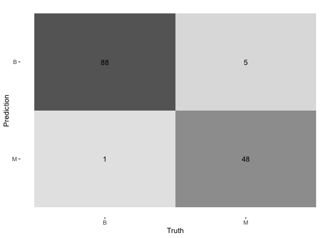
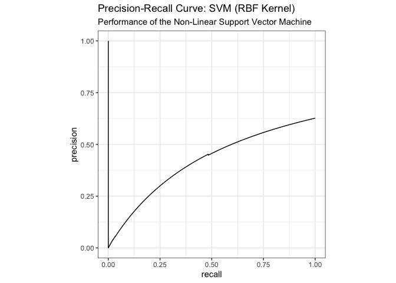

04_Compare_Models.md
================
2025-10-31

``` r
# 1. SETUP LIBRARIES
#library(tidymodels)  # For the core modeling workflow
library(tidyverse)   # For general data manipulation and loading
library(tidymodels)
library(dplyr)
library(tidyr)
library(here)        # For robust file paths
#library(glmnet)      # The 'engine' for penalized regression
library(vip)         # For variable importance plots
#library(conflicted)  # To manage function name conflicts
```

## Compare Machine Learning Methods

``` r
#load from models
rf_output <- read_rds(here("_models", "final_rf_output.rds"))
lasso_output <- read_rds(here("_models", "final_lasso_output.rds"))
svm_output <- read_rds(here("_models", "final_svm_output.rds"))
```

``` r
#combine results
combined_metrics <- bind_rows(
  rf_output$metrics %>% mutate(model = "Random Forest"),
  lasso_output$metrics %>% mutate(model = "Lasso Regression"),
  svm_output$metrics %>% mutate(model = "SVM with RBF Kernel")
)

glimpse(combined_metrics)
```

    ## Rows: 9
    ## Columns: 5
    ## $ .metric    <chr> "accuracy", "roc_auc", "brier_class", "accuracy", "roc_auc"…
    ## $ .estimator <chr> "binary", "binary", "binary", "binary", "binary", "binary",…
    ## $ .estimate  <dbl> 0.95070423, 0.99046004, 0.03621095, 0.95070423, 0.98855205,…
    ## $ .config    <chr> "pre0_mod0_post0", "pre0_mod0_post0", "pre0_mod0_post0", "p…
    ## $ model      <chr> "Random Forest", "Random Forest", "Random Forest", "Lasso R…

``` r
#metrics from preds
# Metrics from ML Course
ml_mets <- metric_set(accuracy, precision, recall)
#create F1 Score Formula
f1_score <- function(precision, recall) {
  2 * (precision * recall) / (precision + recall)
}

combined_predictions <- bind_rows(
  rf_output$preds %>%
    ml_mets(truth = diagnosis, estimate = .pred_class) %>%
    mutate(model = "Random Forest"),
  lasso_output$preds %>%
    ml_mets(truth = diagnosis, estimate = .pred_class) %>%
    mutate(model = "Lasso Regression"),
  svm_output$preds %>%
    ml_mets(truth = diagnosis, estimate = .pred_class) %>%
    mutate(model = "SVM with RBF Kernel")
)

plotting_predictions <- combined_predictions %>% 
  pivot_wider(id_cols = model, names_from = .metric, values_from = .estimate) %>% 
  group_by(model) %>% 
  mutate(F1 = f1_score(precision, recall)) %>% #to compute F1
  pivot_longer(cols = c(accuracy, precision, recall, F1), names_to = "metric", values_to = "value")

plotting_predictions %>% 
ggplot(aes(x=model, y=value, fill=metric)) +
  geom_bar(stat="identity", position="dodge") +
  labs(title="Metrics by Model",
       x="Model",
       y="Metrics") +
  theme_minimal()
```

<!-- -->

## Generate Confusion Matrix for Each Model

# Generate and print the confusion matrix

conf_matrix \<- conf_mat( test_predictions, truth = diagnosis, estimate
= .pred_class, options = list(positive = “M”) \# Set positive = “M” )

print(conf_matrix) autoplot(conf_matrix, type = “heatmap”)

``` r
#CONF matrix for each model, and then a heatmap plot of each confusion matrix
library(purrr)
library(ggplot2)
model_outputs <- list(
  "Random Forest" = rf_output,
  "Lasso Regression" = lasso_output,
  "SVM with RBF Kernel" = svm_output
)
confusion_matrices <- map(model_outputs, function(output) {
  conf_mat(
    output$preds,
    truth = diagnosis,
    estimate = .pred_class,
    options = list(positive = "M")
  )
})

# Plot confusion matrices
patchwork::wrap_plots(
map2(confusion_matrices, names(confusion_matrices), function(cm, model_name) {
  autoplot(cm, type = "heatmap") + ggtitle(paste(model_name))
})
)
```

<!-- -->

``` r
#visualize comparison
#str_extract text in model before first space " "
str_extract(combined_metrics$model, "^[^ ]+")
```

    ## [1] "Random" "Random" "Random" "Lasso"  "Lasso"  "Lasso"  "SVM"    "SVM"   
    ## [9] "SVM"

``` r
ggplot(combined_metrics, aes(x = str_extract(model, "^[^ ]+"), y = .estimate, fill = model)) +
  geom_bar(stat = "identity", position = "dodge") +
  facet_wrap(~.metric, scales = "free_y") +
  scale_y_continuous(limits = c(0.6, 1.0), oob = scales::rescale_none) + # Zoom in on top performance
  labs(title = "Comparison of Machine Learning Methods on BCWDD",
       x = "Model",
       y = "Metric Value") +
    jtools::theme_apa()+
  scale_fill_discrete(palette = "greys") +
  theme(legend.position = "bottom")
```

<!-- -->

\#- V2 —

Markdown

``` r
#1. Load Model Artifacts
rf_output <- readRDS(here("_models", "final_rf_output.rds"))
lasso_output <- readRDS(here("_models", "final_lasso_output.rds"))
svm_output <- readRDS(here("_models", "final_svm_output.rds"))

#2. Compile Performance Metrics

# Helper function for F1 Score
f1_score <- function(precision, recall) {
  2 * (precision * recall) / (precision + recall)
}

# Extract and Combine Metrics
combined_metrics <- bind_rows(
  rf_output$metrics %>% mutate(model = "Random Forest"),
  lasso_output$metrics %>% mutate(model = "Lasso Regression"),
  svm_output$metrics %>% mutate(model = "SVM (RBF)")
)

# Calculate specific metrics (Accuracy, Precision, Recall) from predictions
# This ensures we are using the exact same definitions for all models
ml_mets <- metric_set(accuracy, precision, recall)

combined_predictions <- bind_rows(
  rf_output$preds %>% 
    ml_mets(truth = diagnosis, estimate = .pred_class) %>% 
    mutate(model = "Random Forest"),
  lasso_output$preds %>% 
    ml_mets(truth = diagnosis, estimate = .pred_class) %>% 
    mutate(model = "Lasso Regression"),
  svm_output$preds %>% 
    ml_mets(truth = diagnosis, estimate = .pred_class) %>% 
    mutate(model = "SVM (RBF)")
)

# Reshape for Plotting and add F1 Score
plotting_data <- combined_predictions %>% 
  pivot_wider(id_cols = model, names_from = .metric, values_from = .estimate) %>% 
  mutate(f1 = f1_score(precision, recall)) %>% 
  pivot_longer(cols = c(accuracy, precision, recall, f1), 
               names_to = "metric", 
               values_to = "value")

print(plotting_data)
```

    ## # A tibble: 12 × 3
    ##    model            metric    value
    ##    <chr>            <chr>     <dbl>
    ##  1 Random Forest    accuracy  0.951
    ##  2 Random Forest    precision 0.936
    ##  3 Random Forest    recall    0.989
    ##  4 Random Forest    f1        0.962
    ##  5 Lasso Regression accuracy  0.951
    ##  6 Lasso Regression precision 0.936
    ##  7 Lasso Regression recall    0.989
    ##  8 Lasso Regression f1        0.962
    ##  9 SVM (RBF)        accuracy  0.958
    ## 10 SVM (RBF)        precision 0.946
    ## 11 SVM (RBF)        recall    0.989
    ## 12 SVM (RBF)        f1        0.967

``` r
#3. Visualize Comparative Metrics
ggplot(plotting_data, aes(x = model, y = value, fill = metric)) +
  geom_bar(stat = "identity", position = "dodge", alpha = 0.8, color="black") +
  scale_y_continuous(limits = c(0.9, 1.0), oob = scales::rescale_none) + # Zoom in on top performance
  labs(
    title = "Model Performance Comparison",
    subtitle = "Random Forest and SVM slightly outperform Lasso in Recall (Sensitivity)",
    y = "Score (0-1)",
    x = NULL
  ) +
  jtools::theme_apa()+
  scale_fill_discrete(palette = "greys") +
  theme(legend.position = "bottom")
```

<!-- -->

``` r
#4. Comparative Confusion Matrices
#The cost of false negatives (missing a cancer diagnosis) is high. We visualize the confusion matrices side-by-side to compare how many malignant cases were missed by each model.

# Function to generate a plot for a single model
plot_cm <- function(output, title) {
  cm <- conf_mat(
    output$preds,
    truth = diagnosis,
    estimate = .pred_class,
    options = list(positive = "M")
  )
  autoplot(cm, type = "heatmap") +
    labs(title = title) +
    theme(legend.position = "none")
}

# Create individual plots
p1 <- plot_cm(rf_output, "Random Forest")
p2 <- plot_cm(lasso_output, "Lasso Regression")
p3 <- plot_cm(svm_output, "SVM (RBF)")

# Combine using patchwork
#p1 + p2 + p3
```

``` r
#5. Summary Conclusion
#
# Final Summary Table for Markdown Report
plotting_data %>%
  pivot_wider(names_from = metric, values_from = value) %>%
  arrange(desc(recall)) %>%
  knitr::kable(digits = 3, caption = "Final Model Comparison")
```

| model            | accuracy | precision | recall |    f1 |
|:-----------------|---------:|----------:|-------:|------:|
| Random Forest    |    0.951 |     0.936 |  0.989 | 0.962 |
| Lasso Regression |    0.951 |     0.936 |  0.989 | 0.962 |
| SVM (RBF)        |    0.958 |     0.946 |  0.989 | 0.967 |

Final Model Comparison
